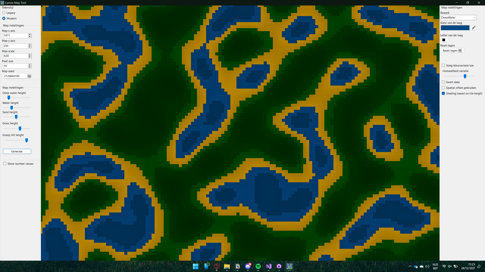

# 2122-CSharpOO-SanderSpaas

## 🕵️ Spyfall  🕵️ ## 
Een toffe eigen versie van de populaire partygame Spyfall.

Je kan gewoon spelen met het standaard databestand, of met je eigen data spelen gemaakt met de ingebouwde editor.
De game ondersteund csv bestanden met als delimiter een ';'.

## 🕵️ Spelregels  🕵️ ## 
Spyfall is een hidden deductie game. In het spel probeert een groep spelers uit te vogelen wie van hen een spion is, en de spion probeert erachter te komen op welke locatie hij/zij is. 
Elke ronde van het spel is extreem eenvoudig. Elke speler krijgt aan het begin van een ronde zijn rol en de locatie te zien.Locaties in het spel zijn bijvoorbeeld een dierentuin, space station en politie station. Een bepaald aantal spelers krijgt is een spion, deze krijgt geen rol en de locatie niet te zien. 
Gedurende de 8 minuten die een ronde duurt mogen spelers vragen stellen aan andere spelers. Er mogen alleen ja nee vragen gesteld worden. De antwoorden die spelers kunnen geven zijn vrij. Spelers moeten opletten de spion niet teveel informatie te geven.Na het antwoord, mag de speler die het antwoord gaf een vraag stellen aan een andere speler dan die hem net een vraag stelde. 
Maakt de Spion een fout en verraadt deze zich, dan kan de rest van de groep winnen door tijdens de ronde een speler te beschuldigen van spion zijn.Elke speler mag 1x per ronde een stemming initiëren. Als alle andere spelers het daarmee eens zijn, is het spel over en kijk je of de speler inderdaad de spion was.Klopt dit? Wint de groep, anders de spion.
Weet de spion gedurende het spel 100 % zeker wat de locatie is, mag hij zeggen dat hij de spion is en de locatie noemen. Klopt het? Dan wint de spion. Na afloop van de 8 minuten krijgt de groep nog één kans om iemand unaniem te beschuldigen. Is dat de spion? Dan wint de groep, anders wint de spion.

## Project Cyclon ## 

Project Cyclon is een tool om maps mee te genereren.
Dit kan je momenteel met 2 tekenstijlen en een heleboel parameters.
De maps gaan gegenereerd worden op basis van simplexnoise.

